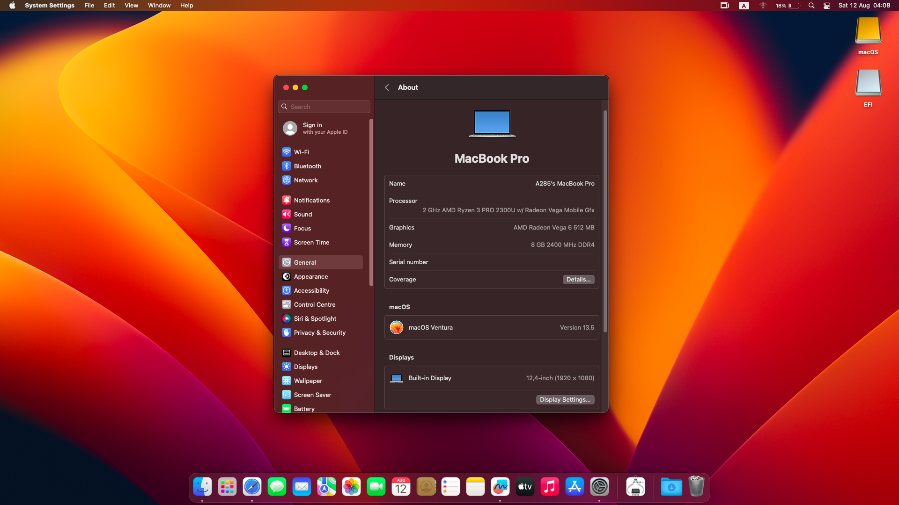

# macOS Ventura 13.5 on Lenovo ThinkPad A285

💻 My configuration:  
| Category  | Component                            |
| --------- | ------------------------------------ |
| CPU       | AMD Ryzen 3 2300U 4-cores            |
| GPU       | AMD Vega 6 512MB                     |
| SSD       | Samsung 970 Evo Plus 500GB           |
| Memory    | 8GB DDR4 2400Mhz                     |
| Screen    | 12,5" 1920x1080 IPS                  |
| WiFi & BT | MediaTek MT7921 (unsupported)        |
 
| BIOS Settings:                       |
| ------------------------------------ |
| Fingerprint reader - OFF             |
| CSM - OFF                            |
| Secure Boot - OFF                    |
| Wake on LAN - OFF                    |
| Anti-Theft Current Setting- OFF      |
| Intel VT-d - ON                      |
| Intel Virtualization Technology - ON |
| Excution Prevention - ON             |
| Security Chip - OFF                  |

To prepare OpenCore to install macOS you need to generate your own serial number, UUID and MLB for `MacBookPro16,3`. You can do that with a script called [GenSMBIOS](https://github.com/corpnewt/GenSMBIOS)

📝 Things to do: 

* repair color banding
* add fan control to yogasmc
* change oc debug ver. to release
* repair not working things (microphone on amd - small chance for repair)
* add macos sonoma support (when it will came out from beta)

✅ Working:
* graphic acceleration 
* backlight keyboard
* audio (with 3,5mm jack port)
* display (there is problem with color banding)
* usb ports
* battery 
* keyboard 
* touchpad and trackpoint
* hdmi port
* micro sd slot

⚠️ Doesn't work:
* wifi and bt (due to unsupported mediatek card, but there are itlwm kexts already)
* webcam (hanging up whole os when trying to open photo booth app)
* microphone (detects internal one, but doesn't work)
* sleeping